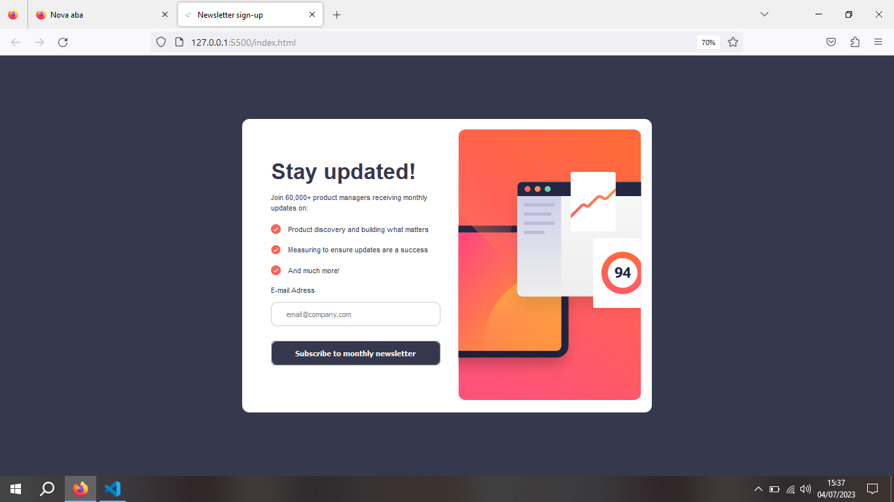
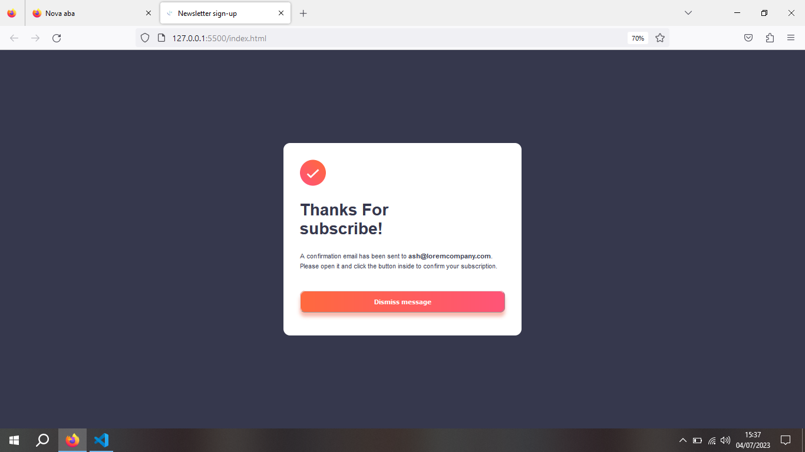

<h1>Primeiro desafio Front End mentor Junior</h1>
 

Neste exercício, usei pela primeira vez o site Front End Mentor. Por não utilizar a versão paga (que eu particularmente não irei pagar), não tenho o Figma do design, então usei muito o olhar artisíco. E mesmo assim fiquei feçliz com o resultado.

 

 

Fiquei muito contente com o resultado alcançado no javascript. Utilizei dois vídeos diferentes do YouTube. Um pra fazer o popup e outro pra validar o email.

 

 

E mesmo utilizando tutoriais que não eram sobre esse desafio, consegui entender, e paerticularmente, fazia tempo que eu não me sentia tanto orgulho de mim! 
